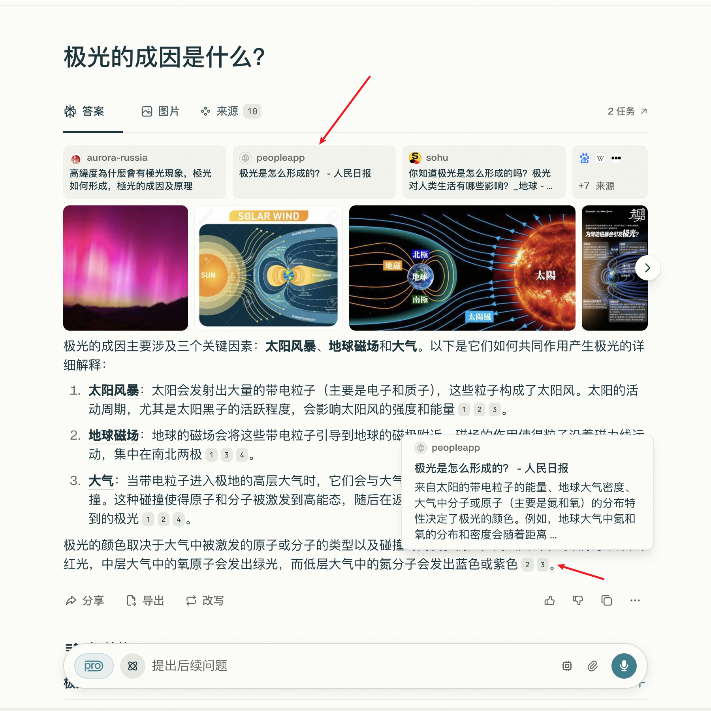
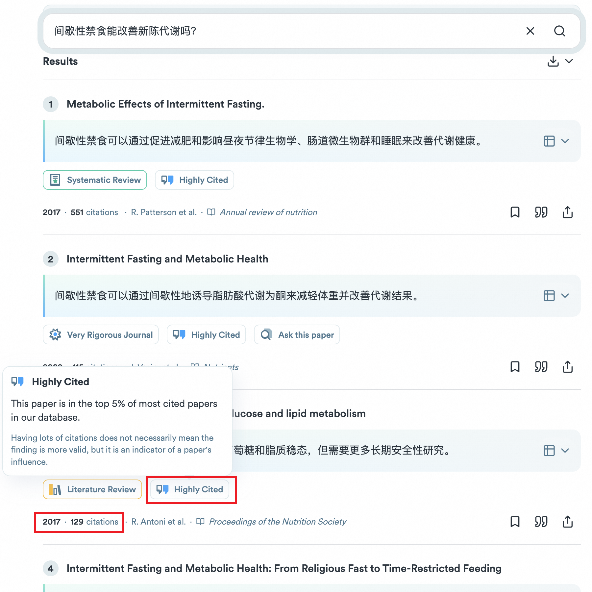
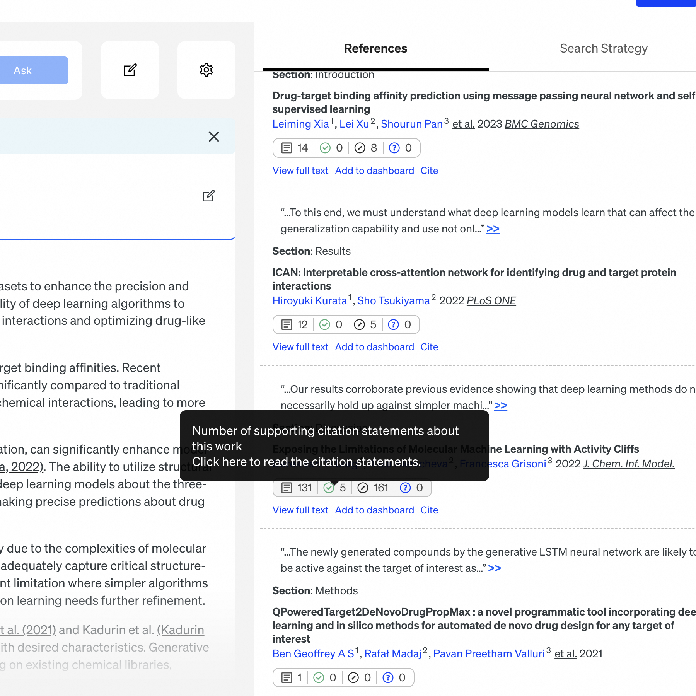
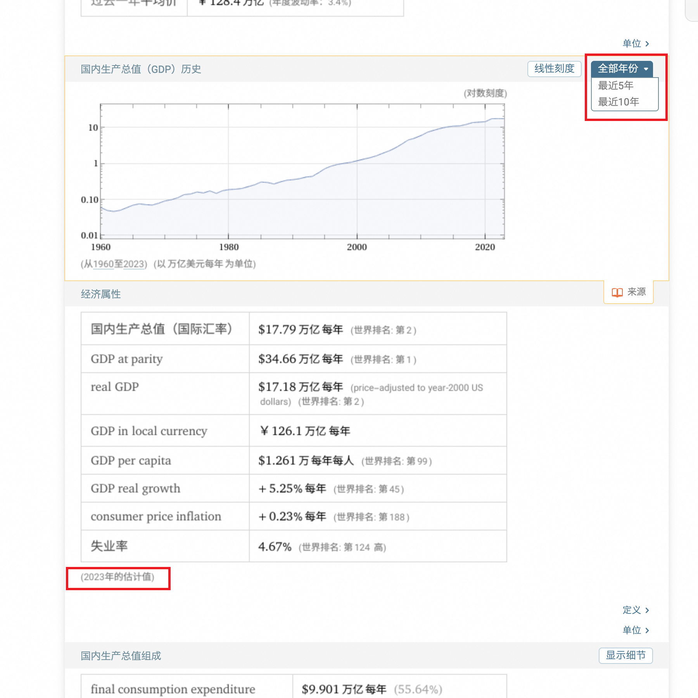
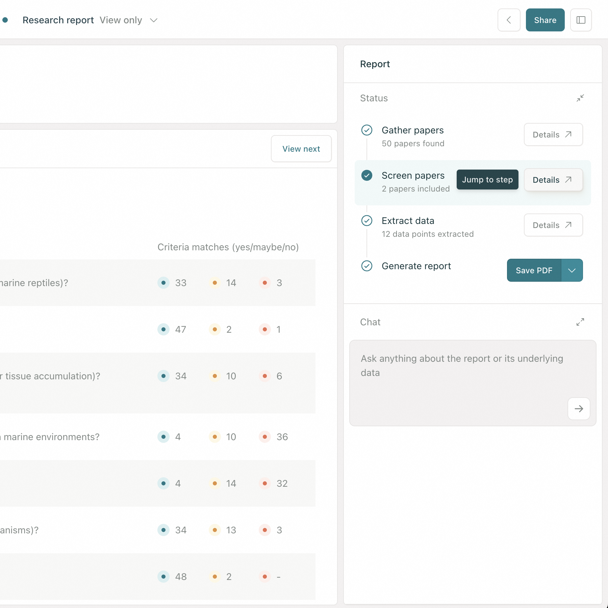
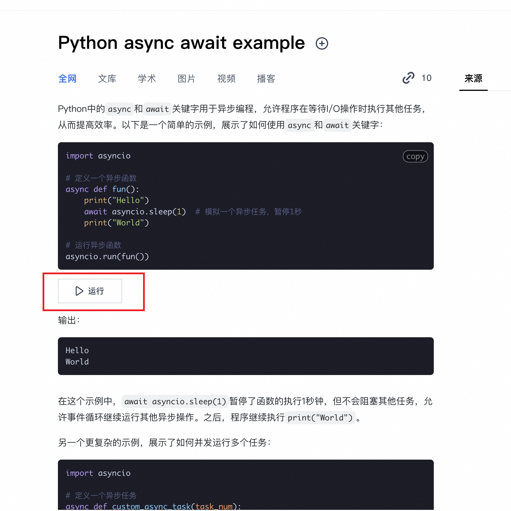

---
# You can also start simply with 'default'
theme: seriph
# random image from a curated Unsplash collection by Anthony
# like them? see https://unsplash.com/collections/94734566/slidev
background: ./assets/bg.png
# some information about your slides (markdown enabled)
title: AI 搜索
info: |
  ## Slidev Starter Template
  Presentation slides for developers.

  Learn more at [Sli.dev](https://sli.dev)
# apply unocss classes to the current slide
class: text-center
# https://sli.dev/features/drawing
drawings:
  persist: false
# slide transition: https://sli.dev/guide/animations.html#slide-transitions
transition: fade
# enable MDC Syntax: https://sli.dev/features/mdc
mdc: true
---

# AI 搜索

AI 搜索产品功能调研与思考

---
layout: center
---

# 1. 什么是 AI 搜索？🤔

---

# 1. 什么是 AI 搜索？

<cite>
AI 搜索（AI-Powered Search）是一种基于人工智能技术的新一代信息检索方式，它通过自然语言处理（NLP）、大语言模型（LLM）、知识图谱等技术，
<u>直接理解用户意图并提供结构化答案</u>，而非仅仅返回网页链接列表。其核心目标是<u>从 “信息匹配” 升级为 “问题解决”</u>。
</cite>

<p v-click class="opacity-50">简单来讲，带来了以下变化：</p>

<div class="flex gap-4 items-center">
  <div v-click class="grow shrink-0">
    <strong>传统搜索</strong>
    <ul>
      <li>搜素引擎：“图书管理员”</li>
      <li>信息获取：“人找信息”</li>
    </ul>
    
  </div>
  <div v-click class="relative w-20 -translate-x-20">
    <arrow x1="0" y1="20" x2="80" y2="20" color="#953" width="2" arrowSize="1" />
  </div>
  <div v-click class="grow shrink-0">
    <strong>AI 搜索</strong>
    <ul>
      <li>搜素引擎：“专业顾问”</li>
      <li>信息获取：“信息为人服务”</li>
    </ul>
    
  </div>
</div>

---
layout: center
---

# 2. 搜索流程有哪些变化？🤔

---

# 2. 搜索流程有哪些变化？

<p v-click>从定义上看，AI 搜索貌似很 “高大上”，但从搜索流程上看，它和传统搜索并无二致。</p>

<p v-click>两种搜索模式都可以划分成以下 5 个阶段：</p>

<ol>
  <li v-click>
    <p>触发阶段（需求诞生）</p>
    🤔 <cite>为什么要进行搜索？</cite>
  </li>
  <li v-click>
    <p>输入阶段（信息表达）</p>
    🤔 <cite>要搜索什么？</cite>
  </li>
  <li v-click>
    <p>处理阶段（等待与交互）</p>
    🤔 <cite>搜索过程中发生了什么？</cite>
  </li>
  <li v-click>
    <p>反馈阶段（结果处理）</p>
    🤔 <cite>搜索结果返回后要如何处理？</cite>
  </li>
  <li v-click>
    <p>后续阶段（行为延伸）</p>
    🤔 <cite>搜索结束后要做什么？</cite>
  </li>
</ol>

<style>
.slidev-layout li {
  line-height: 10px;
}
cite {
  opacity: 0.6;
}
</style>

---
layout: center
---

# 2.1 为什么要进行搜索？

<TimeLine :index="0" />

<div class="w-180 h-80 flex">
  <div class="w-90">
    <ul>
      <li v-click>主动触发：比如写论文需要查一些资料</li>
      <li v-click>被动触发：比如系统推送了一条通知</li>
    </ul>
  </div>
  <div>
    
    
  </div>
</div>

<style>
.slidev-vclick-hidden {
  display: none;
}
</style>

---
layout: center
---

# 2.2 要搜索什么？

<TimeLine :index="1" />

<div class="w-180 h-80 flex">
  <div class="w-90">
    <ul>
      <li v-click>
        文本输入
        <li>直接提问</li>
        <li>关键词堆砌</li>
      </li>
      <li v-click>
        多模态
        <li>图像</li>
        <li>语音</li>
      </li>
      <li v-click>
        历史记录复用
        <li>搜索推荐</li>
        <li>搜索历史</li>
      </li>
    </ul>
  </div>
  <div>
    
    
    
  </div>
</div>

<style>
.slidev-vclick-hidden {
  display: none;
}
.slidev-layout li {
  line-height: 1.8rem;
}
</style>

---
layout: center
---

# 2.3 搜索过程中发生了什么？

<TimeLine :index="2" />

<div class="w-180 h-80 flex">
  <div class="w-90">
    <ul>
      <li v-click>等待响应</li>
      <li v-click>内容展示</li>
      <li v-click>中途放弃</li>
      <li v-click>错误重试</li>
      <li v-click>会话恢复</li>
    </ul>
  </div>
  <div>
    
    
    
    
    
  </div>
</div>

<style>
.slidev-vclick-hidden {
  display: none;
}
</style>

---
layout: center
---

# 2.4 搜索结果返回后要如何处理？

<TimeLine :index="3" />

<div class="w-180 h-80 flex">
  <div class="w-90">
    <ul>
      <li v-click>直接采纳</li>
      <li v-click>交叉验证</li>
      <li v-click>主动修正</li>
      <li v-click>多轮对话</li>
    </ul>
  </div>
  <div>
    
    
    
    
  </div>
</div>

<style>
.slidev-vclick-hidden {
  display: none;
}
</style>

---
layout: center
---

# 2.5 搜索结束后要做什么？

<TimeLine :index="4" />

<div class="w-180 h-80 flex">
  <div class="w-90">
    <ul>
      <li v-click>收藏或订阅相关主题</li>
      <li v-click>加入知识库</li>
      <li v-click>导出结构化数据</li>
      <li v-click>转换成其他操作</li>
    </ul>
  </div>
  <div>
    
    
    
    
  </div>
</div>

<style>
.slidev-vclick-hidden {
  display: none;
}
</style>

---
layout: center
---

# 3. 聚焦在哪块？

---
layout: center
---

# 📌 搜索结果返回后要如何处理？

<TimeLine :index="3" />

<div class="w-180 h-80 flex">
  <div class="w-90">
    <ul>
      <li>直接采纳</li>
      <li>
        <span v-mark.circle.orange>交叉验证</span>
      </li>
      <li>主动修正</li>
      <li>多轮对话</li>
    </ul>
  </div>
  <div>
    
  </div>
</div>

---
layout: center
---

# 4. 交叉验证是什么？

---

# 4. 交叉验证是什么？

🤔 AI 给出答案一定是正确的吗？

<ul>
  <li v-click>🙅</li>
  <li v-click>学习海量的数据和背后的语言规律，再根据你提问的上文，预测可能出现的下文</li>
  <li v-click>“一本正经地胡说八道”，表面看似合理，实则缺乏事实依据</li>
  <li v-click>
    <span v-mark.circle.orange="5">AI 幻觉</span>
  </li>
</ul>

<p v-click="6" class="opacity-50">🤔 如何降低这种 AI 幻觉出现的概率？</p>

<ul>
  <li v-click="7">
    限定条件
    <li v-click="8">“联网搜索”，获取最新数据</li>
    <li v-click="9">“从以下规定的渠道获取信息”，RAG</li>
  </li>
  <li v-click="10">
    <span v-mark.circle.orange="13">交叉验证</span>
    <li v-click="11">标注来源，用户验证</li>
    <li v-click="12">多模型验证</li>
  </li>
</ul>

---
layout: center
---

# 5. 交叉验证有哪些形式？

---
layout: center
---

<WordCloud />

---

# 5. 交叉验证有哪些形式？

市面上这么多的 AI 搜索产品，基本上都提供了交叉验证能力，无非可以分为以下几种形式：

<div class="flex gap-4">
  <ul class="w-120">
    <li v-click="1">
      <span v-mark.circle.orange="24">来源追溯型验证</span>
    <li v-click="2">
      引用来源直链（<a href="https://www.perplexity.ai">Perplexity.ai</a>）
    <li v-click="[3,5]">每个生成段落右侧显示数字角标¹²³</li>
    <li v-click="[4,5]">点击后展开来源网站卡片（包含标题、域名、摘要）</li>
    </li>
    <li v-click="5">
      论文支撑标注（<a href="https://consensus.app">Consensus</a>）
    <li v-click="[6,8]">答案下方显示“Supported by X studies”</li>
    <li v-click="[7,8]">鼠标悬停展示论文标题、期刊、发表年份</li>
    </li>
    </li>
    <li v-click="8">
      动态可信度提示
    <li v-click="9">
      实时置信度评分（<a href="https://scite.ai">Scite</a>）
    <li v-click="[10,12]">答案旁显示动态进度条（如“可信度 82%”）</li>
    <li v-click="[11,12]">根据引用类型（支持/反对）显示不同颜色</li>
    </li>
    <li v-click="12">
      时间线验证（<a href="https://www.wolframalpha.com">Wolfram Alpha</a>）
    <li v-click="[13,15]">关键事实旁显示“2024年7月最新数据”</li>
    <li v-click="[14,15]">时间敏感内容添加时钟图标⚠️</li>
    </li>
    </li>
    <li v-click="15">
      交互式验证探索
    <li v-click="16">
      证据链展开（<a href="https://elicit.org">Elicit</a>）
    <li v-click="[17,19]">点击“查看推理过程”展示逻辑推导步骤</li>
    <li v-click="[18,19]">每个步骤可展开查看支撑论文片段</li>
    </li>
    </li>
    <li v-click="19">
      技术指标型验证
    <li v-click="20">
      代码验证沙盒（<a href="https://www.phind.com">Phind</a>）
    <li v-click="[21,23]">代码答案旁显示“运行验证”按钮</li>
    <li v-click="[22,23]">点击后在线执行代码并显示结果</li>
    </li>
    </li>
  </ul>
  <div class="w-85 h-85">
    
    
    
    
    
    
  </div>
</div>

<style>
.slidev-vclick-hidden {
  display: none;
}
</style>

---
layout: center
---

# 6. 前端是如何实现的？

---

# 6. 前端是如何实现的？

双端差异

| PC 端                                                         | 移动端                                                        |
| ------------------------------------------------------------- | ------------------------------------------------------------- |
| 网速稳定，布局宽松，功能精细                                  | 网速波动大，布局紧凑                                          |
|  |  |

---

# 6. 前端是如何实现的？

DOM 结构设计

```html {all|4-5|8-16|all} twoslash
<div class="ai-answer-block">
  <!-- 答案文本 -->
  <p>
    {answer}
    <!-- 来源标记 -->
    <sup class="source-marker" data-source-id="s123">[1]</sup>
  </p>

  <!-- 悬浮窗容器 -->
  <div class="source-preview" data-source-id="s123">
    <div class="preview-header">
      <span class="domain">{domain}</span>
      <span class="trust-score">{`可信度 ${percent}%`}</span>
    </div>
    <div class="preview-content">{summary}</div>
    <a class="full-link" href="{url}">查看全文 →</a>
  </div>
</div>
```

---

# 6. 前端是如何实现的？

事件处理机制

```js {all|1-3|4|5-6|7-11|15-21|all} twoslash
// 给每个来源标记添加点击事件
document.querySelectorAll(".source-marker").forEach((marker) => {
  marker.addEventListener("click", (e) => {
    const container = e.target
      .closest(".ai-answer-block")
      .querySelector(".source-preview");
    // 切换显示状态
    container.classList.toggle("hidden");
    // 延迟加载内容（性能优化）
    if (!container.dataset.loaded) {
      loadSourceCards(container.dataset.sourceIds);
      container.dataset.loaded = true;
    }
  });
});

// 来源卡片数据加载
async function loadSourceCards(ids) {
  const res = await fetch(`/api/sources?ids=${ids}`);
  const sources = await res.json();
  const container = document.querySelector(".source-preview");
  container.innerHTML = sources.map(createCardHTML).join("");
}
```

---
layout: center
---

# 7. 哪些地方可以优化？

---

# 7. 哪些地方可以优化？

7.1 预加载（解决首次点击时加载延迟）

```js {all|11-13|1-3|4-7|all} twoslash
// 预加载首屏可见区域的来源数据
const observer = new IntersectionObserver((entries) => {
  entries.forEach((entry) => {
    if (entry.isIntersecting) {
      const sourceIds = entry.target.dataset.sourceIds;
      prefetchSources(sourceIds); // 提前发起请求
    }
  });
});

document.querySelectorAll(".ai-answer-block").forEach((segment) => {
  observer.observe(segment);
});
```

---

# 7. 哪些地方可以优化？

7.2 智能优先级加载

```js {all|4|5|6-11|all} twoslash
// 根据用户行为预测加载来源
let predictionTimeout;

document.addEventListener("mousemove", (e) => {
  const hoveredMarker = e.target.closest(".source-marker");
  if (hoveredMarker) {
    clearTimeout(predictionTimeout);
    predictionTimeout = setTimeout(() => {
      loadSourceCards(hoveredMarker.dataset.sourceIds);
    }, 200); // 200ms 悬停预加载
  }
});
```

---

# 7. 哪些地方可以优化？

7.3 跨段落来源聚合

```js {all|3|5|6|7-9|10-12|15-19|all} twoslash
// 合并相同来源的引用标记
function mergeDuplicateSources() {
  const sourceMap = new Map();

  document.querySelectorAll(".source-card").forEach((card) => {
    const key = card.dataset.url;
    if (sourceMap.has(key)) {
      card.remove();
      sourceMap.get(key).count++;
    } else {
      sourceMap.set(key, { element: card, count: 1 });
    }
  });

  // 更新标记显示
  sourceMap.forEach((value, key) => {
    value.element.querySelector(".source-count").textContent =
      `被引用 ${value.count} 次`;
  });
}
```

---
layout: end
---

# Thank You
