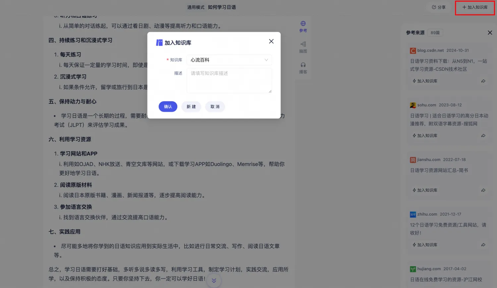

---
# You can also start simply with 'default'
theme: seriph
# random image from a curated Unsplash collection by Anthony
# like them? see https://unsplash.com/collections/94734566/slidev
background: ./assets/bg.png
# some information about your slides (markdown enabled)
title: AI 搜索
info: |
  ## Slidev Starter Template
  Presentation slides for developers.

  Learn more at [Sli.dev](https://sli.dev)
# apply unocss classes to the current slide
class: text-center
# https://sli.dev/features/drawing
drawings:
  persist: false
# slide transition: https://sli.dev/guide/animations.html#slide-transitions
transition: fade
# enable MDC Syntax: https://sli.dev/features/mdc
mdc: true
---

# AI 搜索

AI 搜索产品功能调研与思考

---
layout: center
---

# 1. 什么是 AI 搜索？🤔

---

# 1. 什么是 AI 搜索？

<cite>
AI 搜索（AI-Powered Search）是一种基于人工智能技术的新一代信息检索方式，它通过自然语言处理（NLP）、大语言模型（LLM）、知识图谱等技术，
<u>直接理解用户意图并提供结构化答案</u>，而非仅仅返回网页链接列表。其核心目标是<u>从 “信息匹配” 升级为 “问题解决”</u>。
</cite>

<p v-click class="opacity-50">简单来讲，带来了以下变化：</p>

<div class="flex gap-4 items-center">
  <div v-click class="grow shrink-0">
    <strong>传统搜索</strong>
    <ul>
      <li>搜素引擎：“图书管理员”</li>
      <li>信息获取：“人找信息”</li>
    </ul>
    
  </div>
  <div v-click class="relative w-20 -translate-x-20">
    <arrow x1="0" y1="20" x2="80" y2="20" color="#953" width="2" arrowSize="1" />
  </div>
  <div v-click class="grow shrink-0">
    <strong>AI 搜索</strong>
    <ul>
      <li>搜素引擎：“专业顾问”</li>
      <li>信息获取：“信息为人服务”</li>
    </ul>
    
  </div>
</div>

---
layout: center
---

# 2. 搜索流程有哪些变化？🤔

---

# 2. 搜索流程有哪些变化？

<p v-click>从定义上看，AI 搜索貌似很 “高大上”，但从搜索流程上看，它和传统搜索并无二致。</p>

<p v-click>两种搜索模式都可以划分成以下 5 个阶段：</p>

<ol>
  <li v-click>
    <p>触发阶段（需求诞生）</p>
    🤔 <cite>为什么要进行搜索？</cite>
  </li>
  <li v-click>
    <p>输入阶段（信息表达）</p>
    🤔 <cite>要搜索什么？</cite>
  </li>
  <li v-click>
    <p>处理阶段（等待与交互）</p>
    🤔 <cite>搜索过程中发生了什么？</cite>
  </li>
  <li v-click>
    <p>反馈阶段（结果处理）</p>
    🤔 <cite>搜索结果返回后要如何处理？</cite>
  </li>
  <li v-click>
    <p>后续阶段（行为延伸）</p>
    🤔 <cite>搜索结束后要做什么？</cite>
  </li>
</ol>

<style>
.slidev-layout li {
  line-height: 10px;
}
cite {
  opacity: 0.6;
}
</style>

---
layout: center
---

# 2.1 为什么要进行搜索？

<TimeLine :index="0" />

<div class="w-180 h-80 flex">
  <div class="w-90">
    <ul>
      <li v-click>主动触发：比如写论文需要查一些资料</li>
      <li v-click>被动触发：比如系统推送了一条通知</li>
    </ul>
  </div>
  <div>
    
    
  </div>
</div>

<style>
.slidev-vclick-hidden {
  display: none;
}
</style>

---
layout: center
---

# 2.2 要搜索什么？

<TimeLine :index="1" />

<div class="w-180 h-80 flex">
  <div class="w-90">
    <ul>
      <li v-click>
        文本输入
        <li>直接提问</li>
        <li>关键词堆砌</li>
      </li>
      <li v-click>
        多模态
        <li>图像</li>
        <li>语音</li>
      </li>
      <li v-click>
        历史记录复用
        <li>搜索推荐</li>
        <li>搜索历史</li>
      </li>
    </ul>
  </div>
  <div>
    
    
    
  </div>
</div>

<style>
.slidev-vclick-hidden {
  display: none;
}
</style>

---
layout: center
---

# 2.3 搜索过程中发生了什么？

<TimeLine :index="2" />

<div class="w-180 h-80 flex">
  <div class="w-90">
    <ul>
      <li v-click>等待响应</li>
      <li v-click>内容展示</li>
      <li v-click>中途放弃</li>
      <li v-click>错误重试</li>
      <li v-click>会话恢复</li>
    </ul>
  </div>
  <div>
    
    
    
    
    
  </div>
</div>

<style>
.slidev-vclick-hidden {
  display: none;
}
</style>

---
layout: center
---

# 2.4 搜索结果返回后要如何处理？

<TimeLine :index="3" />

<div class="w-180 h-80 flex">
  <div class="w-90">
    <ul>
      <li v-click>直接采纳</li>
      <li v-click>交叉验证</li>
      <li v-click>主动修正</li>
      <li v-click>多轮对话</li>
    </ul>
  </div>
  <div>
    
    
    
    
  </div>
</div>

<style>
.slidev-vclick-hidden {
  display: none;
}
</style>

---
layout: center
---

# 2.5 搜索结束后要做什么？

<TimeLine :index="4" />

<div class="w-180 h-80 flex">
  <div class="w-90">
    <ul>
      <li v-click>收藏或订阅相关主题</li>
      <li v-click>加入知识库</li>
      <li v-click>导出结构化数据</li>
      <li v-click>转换成其他操作</li>
    </ul>
  </div>
  <div>
    
    
    
    
  </div>
</div>

<style>
.slidev-vclick-hidden {
  display: none;
}
</style>

---
layout: center
---

# 3. 聚焦在哪块？

---
layout: center
---

# 📌 搜索结果返回后要如何处理？

<TimeLine :index="3" />

<div class="w-180 h-80 flex">
  <div class="w-90">
    <ul>
      <li>直接采纳</li>
      <li>
        <span v-mark.circle.orange>交叉验证</span>
      </li>
      <li>主动修正</li>
      <li>多轮对话</li>
    </ul>
  </div>
  <div>
    
  </div>
</div>

---
layout: center
---

# 4. 交叉验证是什么？

---

# 4. 交叉验证是什么？

🤔 AI 给出答案一定是正确的吗？

<ul>
  <li v-click>🙅</li>
  <li v-click>学习海量的数据和背后的语言规律，再根据你提问的上文，预测可能出现的下文</li>
  <li v-click>“一本正经地胡说八道”，表面看似合理，实则缺乏事实依据</li>
  <li v-click>
    <span v-mark.circle.orange="5">AI 幻觉</span>
  </li>
</ul>

<p v-click="6" class="opacity-50">🤔 如何降低这种 AI 幻觉出现的概率？</p>


<ul>
  <li v-click="7">
    限定条件
    <li v-click="8">“联网搜索”，获取最新数据</li>
    <li v-click="9">“从以下规定的渠道获取信息”，RAG</li>
  </li>
  <li v-click="10">
    <span v-mark.circle.orange="13">交叉验证</span>
    <li v-click="11">标注来源，用户验证</li>
    <li v-click="12">多模型验证</li>
  </li>
</ul>

---
layout: center
---

# 5. 交叉验证有哪些形式？

---
layout: center
---

<WordCloud />

---

# 5. 交叉验证有哪些形式？

市面上这么多的 AI 搜索产品，基本上都提供了交叉验证能力，无非可以分为以下几种形式：

<ul>
  <li v-click="1">
    来源追溯型验证
    <li v-click="2">
      引用来源直链（Perplexity.ai）
      <li v-click="[3,5]">每个生成段落右侧显示数字角标¹²³</li>
      <li v-click="[4,5]">点击后展开来源网站卡片（包含标题、域名、摘要）</li>
    </li>
    <li v-click="5">
      论文支撑标注（Consensus）
      <li v-click="[6,8]">答案下方显示“Supported by X studies”</li>
      <li v-click="[7,8]">鼠标悬停展示论文标题、期刊、发表年份</li>
    </li>
  </li>
  <li v-click="8">
    动态可信度提示
    <li v-click="9">
      实时置信度评分（Scite）
      <li v-click="[10,12]">答案旁显示动态进度条（如“可信度 82%”）</li>
      <li v-click="[11,12]">根据引用类型（支持/反对）显示不同颜色</li>
    </li>
    <li v-click="12">
      时间线验证（Google SGE）
      <li v-click="[13,15]">关键事实旁显示“2024年7月最新数据”</li>
      <li v-click="[14,15]">时间敏感内容添加时钟图标⚠️</li>
    </li>
  </li>
  <li v-click="15">
    交互式验证探索
    <li v-click="16">
      证据链展开（Elicit）
      <li v-click="[17,19]">点击“查看推理过程”展示逻辑推导步骤</li>
      <li v-click="[18,19]">每个步骤可展开查看支撑论文片段</li>
    </li>
    <li v-click="19">
      多版本答案对比（You.com）
      <li v-click="[20,22]">侧边栏展示不同模型生成的答案版本</li>
      <li v-click="[21,22]">用户可滑动对比GPT-4/Claude/Palm的输出</li>
    </li>
  </li>
  <li v-click="22">
    技术指标型验证
    <li v-click="23">
      代码验证沙盒（Phind）
      <li v-click="[24,26]">代码答案旁显示“运行验证”按钮</li>
      <li v-click="[25,26]">点击后在线执行代码并显示结果</li>
    </li>
  </li>
</ul>

<style>
.slidev-vclick-hidden {
  display: none;
}
</style>

---

# Navigation

Hover on the bottom-left corner to see the navigation's controls panel, [learn more](https://sli.dev/guide/ui#navigation-bar)

## Keyboard Shortcuts

|                                                    |                             |
| -------------------------------------------------- | --------------------------- |
| <kbd>right</kbd> / <kbd>space</kbd>                | next animation or slide     |
| <kbd>left</kbd> / <kbd>shift</kbd><kbd>space</kbd> | previous animation or slide |
| <kbd>up</kbd>                                      | previous slide              |
| <kbd>down</kbd>                                    | next slide                  |

<!-- https://sli.dev/guide/animations.html#click-animation -->


<p v-after class="absolute bottom-23 left-45 opacity-30 transform -rotate-10">Here!</p>

---

layout: two-cols
layoutClass: gap-16

---

# Table of contents

You can use the `Toc` component to generate a table of contents for your slides:

```html
<Toc minDepth="1" maxDepth="1" />
```

The title will be inferred from your slide content, or you can override it with `title` and `level` in your frontmatter.

::right::

<Toc text-sm minDepth="1" maxDepth="2" />

---

layout: image-right
image: https://cover.sli.dev

---

# Code

Use code snippets and get the highlighting directly, and even types hover!

```ts {all|5|7|7-8|10|all} twoslash
// TwoSlash enables TypeScript hover information
// and errors in markdown code blocks
// More at https://shiki.style/packages/twoslash

import { computed, ref } from "vue";

const count = ref(0);
const doubled = computed(() => count.value * 2);

doubled.value = 2;
```

<arrow v-click="[4, 5]" x1="350" y1="310" x2="195" y2="334" color="#953" width="2" arrowSize="1" />

<!-- This allow you to embed external code blocks -->

<<< @/snippets/external.ts#snippet

<!-- Footer -->

[Learn more](https://sli.dev/features/line-highlighting)

<!-- Inline style -->
<style>
.footnotes-sep {
  @apply mt-5 opacity-10;
}
.footnotes {
  @apply text-sm opacity-75;
}
.footnote-backref {
  display: none;
}
</style>

<!--
Notes can also sync with clicks

[click] This will be highlighted after the first click

[click] Highlighted with `count = ref(0)`

[click:3] Last click (skip two clicks)
-->

---

## level: 2

# Shiki Magic Move

Powered by [shiki-magic-move](https://shiki-magic-move.netlify.app/), Slidev supports animations across multiple code snippets.

Add multiple code blocks and wrap them with <code>````md magic-move</code> (four backticks) to enable the magic move. For example:

````md magic-move {lines: true}
```ts {*|2|*}
// step 1
const author = reactive({
  name: "John Doe",
  books: [
    "Vue 2 - Advanced Guide",
    "Vue 3 - Basic Guide",
    "Vue 4 - The Mystery",
  ],
});
```

```ts {*|1-2|3-4|3-4,8}
// step 2
export default {
  data() {
    return {
      author: {
        name: "John Doe",
        books: [
          "Vue 2 - Advanced Guide",
          "Vue 3 - Basic Guide",
          "Vue 4 - The Mystery",
        ],
      },
    };
  },
};
```

```ts
// step 3
export default {
  data: () => ({
    author: {
      name: "John Doe",
      books: [
        "Vue 2 - Advanced Guide",
        "Vue 3 - Basic Guide",
        "Vue 4 - The Mystery",
      ],
    },
  }),
};
```

Non-code blocks are ignored.

```vue
<!-- step 4 -->
<script setup>
const author = {
  name: "John Doe",
  books: [
    "Vue 2 - Advanced Guide",
    "Vue 3 - Basic Guide",
    "Vue 4 - The Mystery",
  ],
};
</script>
```
````

---

# Components

<div grid="~ cols-2 gap-4">
<div>

You can use Vue components directly inside your slides.

We have provided a few built-in components like `<Tweet/>` and `<Youtube/>` that you can use directly. And adding your custom components is also super easy.

```html
<Counter :count="10" />
```

<!-- ./components/Counter.vue -->
<Counter :count="10" m="t-4" />

Check out [the guides](https://sli.dev/builtin/components.html) for more.

</div>
<div>

```html
<Tweet id="1390115482657726468" />
```

<Tweet id="1390115482657726468" scale="0.65" />

</div>
</div>

<!--
Presenter note with **bold**, *italic*, and ~~striked~~ text.

Also, HTML elements are valid:
<div class="flex w-full">
  <span style="flex-grow: 1;">Left content</span>
  <span>Right content</span>
</div>
-->

---

## class: px-20

# Themes

Slidev comes with powerful theming support. Themes can provide styles, layouts, components, or even configurations for tools. Switching between themes by just **one edit** in your frontmatter:

<div grid="~ cols-2 gap-2" m="t-2">

```yaml
---
theme: default
---
```

```yaml
---
theme: seriph
---
```


</div>

Read more about [How to use a theme](https://sli.dev/guide/theme-addon#use-theme) and
check out the [Awesome Themes Gallery](https://sli.dev/resources/theme-gallery).

---

# Clicks Animations

You can add `v-click` to elements to add a click animation.

<div v-click>

This shows up when you click the slide:

```html
<div v-click>This shows up when you click the slide.</div>
```

</div>

<br>

<v-click>

The <span v-mark.red="3"><code>v-mark</code> directive</span>
also allows you to add
<span v-mark.circle.orange="4">inline marks</span>
, powered by [Rough Notation](https://roughnotation.com/):

```html
<span v-mark.underline.orange>inline markers</span>
```

</v-click>

<div mt-20 v-click>

[Learn more](https://sli.dev/guide/animations#click-animation)

</div>

---

# Motions

Motion animations are powered by [@vueuse/motion](https://motion.vueuse.org/), triggered by `v-motion` directive.

```html
<div
  v-motion
  :initial="{ x: -80 }"
  :enter="{ x: 0 }"
  :click-3="{ x: 80 }"
  :leave="{ x: 1000 }"
>
  Slidev
</div>
```

<div class="w-60 relative">
  <div class="relative w-40 h-40">
    
    
    
  </div>

  <div
    class="text-5xl absolute top-14 left-40 text-[#2B90B6] -z-1"
    v-motion
    :initial="{ x: -80, opacity: 0}"
    :enter="{ x: 0, opacity: 1, transition: { delay: 2000, duration: 1000 } }">
    Slidev
  </div>
</div>

<!-- vue script setup scripts can be directly used in markdown, and will only affects current page -->
<script setup lang="ts">
const final = {
  x: 0,
  y: 0,
  rotate: 0,
  scale: 1,
  transition: {
    type: 'spring',
    damping: 10,
    stiffness: 20,
    mass: 2
  }
}
</script>

<div
  v-motion
  :initial="{ x:35, y: 30, opacity: 0}"
  :enter="{ y: 0, opacity: 1, transition: { delay: 3500 } }">

[Learn more](https://sli.dev/guide/animations.html#motion)

</div>

---

# LaTeX

LaTeX is supported out-of-box. Powered by [KaTeX](https://katex.org/).

<div h-3 />

Inline $\sqrt{3x-1}+(1+x)^2$

Block

$$
{1|3|all}
\begin{aligned}
\nabla \cdot \vec{E} &= \frac{\rho}{\varepsilon_0} \\
\nabla \cdot \vec{B} &= 0 \\
\nabla \times \vec{E} &= -\frac{\partial\vec{B}}{\partial t} \\
\nabla \times \vec{B} &= \mu_0\vec{J} + \mu_0\varepsilon_0\frac{\partial\vec{E}}{\partial t}
\end{aligned}
$$

[Learn more](https://sli.dev/features/latex)

---

# Diagrams

You can create diagrams / graphs from textual descriptions, directly in your Markdown.

<div class="grid grid-cols-4 gap-5 pt-4 -mb-6">


</div>

Learn more: [Mermaid Diagrams](https://sli.dev/features/mermaid) and [PlantUML Diagrams](https://sli.dev/features/plantuml)

---

foo: bar
dragPos:
square: 691,32,167,\_,-16

---

dragPos:
square: -8,0,0,0

---

dragPos:
square: -8,0,0,0

---

dragPos:
square: -8,0,0,0

---

dragPos:
square: -8,0,0,0

---

dragPos:
square: -8,0,0,0

---

dragPos:
square: -8,0,0,0

---

dragPos:
square: -8,0,0,0

---

dragPos:
square: -8,0,0,0

---

dragPos:
square: -8,0,0,0

---

dragPos:
square: -8,0,0,0

---

dragPos:
square: -8,0,0,0

---

dragPos:
square: -8,0,0,0

---

dragPos:
square: -8,0,0,0

---
dragPos:
  square: -8,0,0,0
---

# Draggable Elements

Double-click on the draggable elements to edit their positions.

<br>

###### Directive Usage

```md

```

<br>

###### Component Usage

```md
<v-drag text-3xl>
  <div class="i-carbon:arrow-up" />
  Use the `v-drag` component to have a draggable container!
</v-drag>
```

<v-drag pos="663,206,261,_,-15">
  <div text-center text-3xl border border-main rounded>
    Double-click me!
  </div>
</v-drag>


###### Draggable Arrow

```md
<v-drag-arrow two-way />
```

<v-drag-arrow pos="67,452,253,46" two-way op70 />

---

src: ./pages/imported-slides.md
hide: false

---


---

# Monaco Editor

Slidev provides built-in Monaco Editor support.

Add `{monaco}` to the code block to turn it into an editor:

```ts {monaco}
import { ref } from "vue";
import { emptyArray } from "./external";

const arr = ref(emptyArray(10));
```

Use `{monaco-run}` to create an editor that can execute the code directly in the slide:

```ts {monaco-run}
import { version } from "vue";
import { emptyArray, sayHello } from "./external";

sayHello();
console.log(`vue ${version}`);
console.log(
  emptyArray<number>(10).reduce(
    (fib) => [...fib, fib.at(-1)! + fib.at(-2)!],
    [1, 1],
  ),
);
```

---

layout: center
class: text-center

---

# Learn More

[Documentation](https://sli.dev) · [GitHub](https://github.com/slidevjs/slidev) · [Showcases](https://sli.dev/resources/showcases)

<PoweredBySlidev mt-10 />
